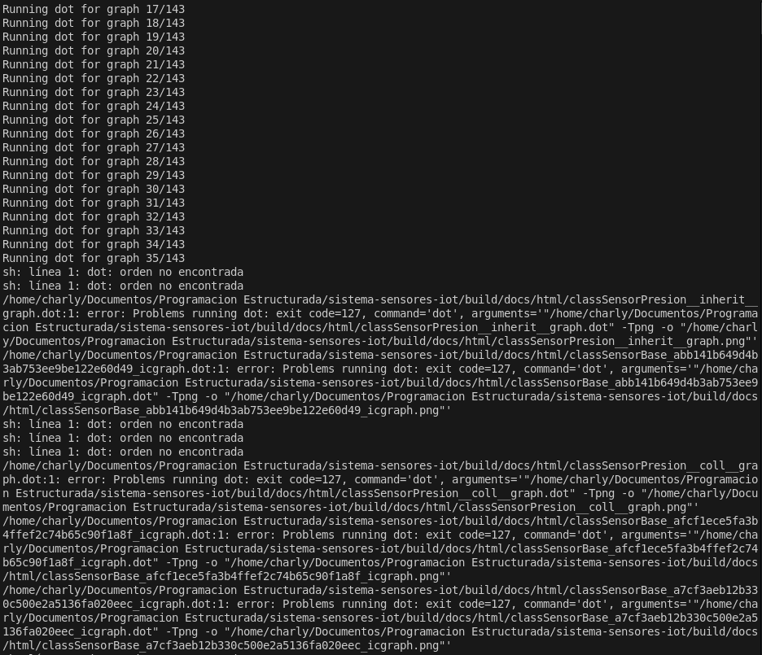
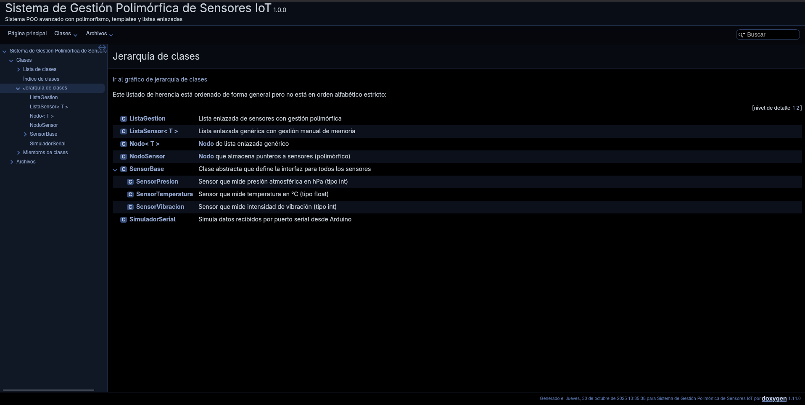

# Manual Técnico
## Sistema de Gestión Polimórfica de Sensores para IoT

**Autor:** Carlos Vargas  
**Fecha:** 30 de octubre de 2025  

---

## 1. Introducción

### 1.1 Propósito del Documento
Este manual técnico describe la arquitectura, diseño, desarrollo e implementación del Sistema de Gestión Polimórfica de Sensores para IoT, desarrollado como parte de la asignatura de Programación Orientada a Objetos.

### 1.2 Alcance del Sistema
El sistema permite la gestión unificada de múltiples tipos de sensores (temperatura, presión, vibración) mediante:
- Polimorfismo y herencia en POO
- Listas enlazadas genéricas con templates
- Gestión manual de memoria dinámica
- Integración con dispositivos Arduino

### 1.3 Definiciones y Acrónimos
- **POO**: Programación Orientada a Objetos
- **IoT**: Internet of Things (Internet de las Cosas)
- **IC**: Infraestructura Crítica
- **CMake**: Cross-platform Make

---

## 2. Arquitectura del Sistema

### 2.1 Diseño General

El sistema implementa una arquitectura basada en capas:

```
┌─────────────────────────────────────────┐
│     Capa de Presentación (main.cpp)     │
│         (Interfaz de Usuario)           │
├─────────────────────────────────────────┤
│   Capa de Lógica de Negocio             │
│   - ListaGestion (Polimorfismo)         │
│   - SensorBase (Clase Abstracta)        │
├─────────────────────────────────────────┤
│   Capa de Datos                         │
│   - ListaSensor<T> (Templates)          │
│   - Nodo<T> (Estructuras de Datos)      │
├─────────────────────────────────────────┤
│   Capa de Integración                   │
│   - SimuladorSerial (Arduino)           │
└─────────────────────────────────────────┘
```

### 2.2 Diagrama de Clases UML

```
                    ┌─────────────────────┐
                    │   SensorBase        │
                    │   <<abstract>>      │
                    ├─────────────────────┤
                    │ # nombre: char[50]  │
                    ├─────────────────────┤
                    │ + SensorBase(id)    │
                    │ + ~SensorBase() vir │
                    │ + procesarLectura()=0│
                    │ + imprimirInfo()=0  │
                    │ + registrarLectura()=0│
                    │ + obtenerNombre()   │
                    └──────────┬──────────┘
                               │
         ┌─────────────────────┼─────────────────────┐
         │                     │                     │
    ┌────▼─────────┐   ┌──────▼────────┐   ┌───────▼────────┐
    │SensorTemp    │   │SensorPresion  │   │SensorVibracion │
    ├──────────────┤   ├───────────────┤   ├────────────────┤
    │-historial:   │   │-historial:    │   │-historial:     │
    │ Lista<float> │   │ Lista<int>    │   │ Lista<int>     │
    ├──────────────┤   ├───────────────┤   ├────────────────┤
    │+procesarLec()│   │+procesarLec() │   │+procesarLec()  │
    │+imprimirInfo()│  │+imprimirInfo()│   │+imprimirInfo() │
    │+registrarLec()│  │+registrarLec()│   │+registrarLec() │
    └──────────────┘   └───────────────┘   └────────────────┘

    ┌──────────────────────────┐
    │   ListaSensor<T>         │
    │   <<template>>           │
    ├──────────────────────────┤
    │ - inicio: Nodo<T>*       │
    │ - cantidad: int          │
    ├──────────────────────────┤
    │ + ListaSensor()          │
    │ + ~ListaSensor()         │
    │ + insertarAlFinal(T)     │
    │ + buscar(T): bool        │
    │ + calcularPromedio(): T  │
    │ + eliminarMinimo(): T    │
    │ + obtenerCantidad(): int │
    │ + mostrar()              │
    └──────────────────────────┘
```

### 2.3 Flujo de Datos

```
Arduino → Serial → SimuladorSerial → Parseo → ListaGestion
                                                     │
                                                     ▼
                                        buscarSensor(ID) ?
                                                     │
                                        ┌────────────┴────────────┐
                                        │                         │
                                    Existe?                   No existe
                                        │                         │
                                        ▼                         ▼
                              registrarLectura()          crearSensor()
                                        │                         │
                                        ▼                         │
                              ListaSensor<T>::insertar()          │
                                        │                         │
                                        └─────────────────────────┘
                                                     │
                                                     ▼
                                          Dato almacenado
```

---

## 3. Diseño Detallado

### 3.1 Clase SensorBase (Abstracta)

**Propósito:** Definir la interfaz común para todos los sensores.

**Métodos Virtuales Puros:**
```cpp
virtual void procesarLectura() = 0;
virtual void imprimirInfo() const = 0;
virtual void registrarLectura(const char* lectura) = 0;
```

**Justificación del Destructor Virtual:**
```cpp
virtual ~SensorBase() { }
```
El destructor DEBE ser virtual para garantizar que cuando eliminemos un objeto derivado a través de un puntero a la base, se llame al destructor correcto y se libere toda la memoria.

**Ejemplo sin destructor virtual (INCORRECTO):**
```cpp
SensorBase* s = new SensorTemperatura("T-001");
delete s;  // Solo llama a ~SensorBase(), NO libera ListaSensor<float>
           // ¡FUGA DE MEMORIA!
```

**Ejemplo con destructor virtual (CORRECTO):**
```cpp
SensorBase* s = new SensorTemperatura("T-001");
delete s;  // Llama a ~SensorTemperatura() → ~SensorBase()
           // ✓ Memoria liberada correctamente
```

### 3.2 Clases Derivadas Concretas

#### 3.2.1 SensorTemperatura

**Tipo de dato:** `float` (para precisión decimal)

**Estrategia de procesamiento:**
1. Eliminar la lectura más baja (filtro de ruido)
2. Calcular promedio de las restantes
3. Aumentar precisión de mediciones

**Implementación:**
```cpp
void procesarLectura() override {
    if (historial.obtenerCantidad() > 1) {
        float minimo = historial.eliminarMinimo();
        float promedio = historial.calcularPromedio();
        // Mostrar resultados...
    }
}
```

#### 3.2.2 SensorPresion

**Tipo de dato:** `int` (valores enteros suficientes para kPa)

**Estrategia de procesamiento:**
1. Calcular promedio de todas las lecturas
2. Detectar tendencias (subida/bajada de presión)

#### 3.2.3 SensorVibracion

**Tipo de dato:** `int` (frecuencia en Hz)

**Estrategia de procesamiento:**
1. Calcular promedio de frecuencias
2. Detectar alertas si > 100 Hz (vibración elevada)

### 3.3 ListaSensor<T> - Template Genérico

**Regla de los Tres implementada:**

```cpp
template <typename T>
class ListaSensor {
public:
    // 1. Destructor
    ~ListaSensor() {
        liberar();
    }
    
    // 2. Constructor de copia
    ListaSensor(const ListaSensor<T>& otra) {
        // Copia profunda de nodos
    }
    
    // 3. Operador de asignación
    ListaSensor<T>& operator=(const ListaSensor<T>& otra) {
        if (this != &otra) {
            liberar();  // Liberar memoria actual
            // Copiar desde 'otra'
        }
        return *this;
    }
};
```

**Justificación:**
Sin la Regla de los Tres, ocurriría:
- **Copia superficial**: Dos objetos apuntando a la misma memoria
- **Doble liberación**: Al destruirse ambos, `delete` sobre memoria ya liberada
- **Fugas de memoria**: La memoria original nunca se libera

### 3.4 ListaGestion - Polimorfismo

**Característica clave:** Almacena `SensorBase*` (punteros a la base)

```cpp
struct NodoSensor {
    SensorBase* sensor;  // Polimórfico
    NodoSensor* siguiente;
};
```

**Ventaja:** Permite almacenar diferentes tipos de sensores en una única lista:
```cpp
listaGestion.agregarSensor(new SensorTemperatura("T-001"));
listaGestion.agregarSensor(new SensorPresion("P-105"));
listaGestion.agregarSensor(new SensorVibracion("V-201"));
```

**Procesamiento polimórfico:**
```cpp
void procesarTodosSensores() {
    NodoSensor* actual = inicio;
    while (actual != nullptr) {
        actual->sensor->procesarLectura();  // Llama al método correcto
        actual = actual->siguiente;
    }
}
```

---

## 4. Desarrollo e Implementación

### 4.1 Tecnologías Utilizadas

| Componente | Tecnología | Versión |
|------------|------------|---------|
| Lenguaje | C++ | C++11 |
| Sistema de Construcción | CMake | 3.10+ |
| Compilador | GCC/Clang | 7.0+ / 5.0+ |
| Documentación | Doxygen | 1.8+ |
| Hardware | Arduino | Uno/Nano/Mega |
| IDE Arduino | Arduino IDE | 1.8+ |

### 4.2 Estructura de Directorios

```
sistema-sensores-iot/
├── CMakeLists.txt          # Build system
├── README.md               # Documentación usuario
├── MANUAL_TECNICO.md       # Este documento
│
├── include/                # Headers (.h)
│   ├── ListaSensor.h       # Template genérico
│   ├── SensorBase.h        # Clase abstracta
│   ├── SensorTemperatura.h # Sensor concreto
│   ├── SensorPresion.h     # Sensor concreto
│   ├── SensorVibracion.h   # Sensor concreto
│   ├── ListaGestion.h      # Lista polimórfica
│   └── SimuladorSerial.h   # Arduino simulator
│
├── src/                    # Implementaciones (.cpp)
│   └── main.cpp            # Punto de entrada
│
├── arduino/                # Código Arduino
│   └── simulador_arduino.ino
│
├── docs/                   # Documentación
│   └── Doxyfile.in         # Config Doxygen
│
└── build/                  # Directorio de compilación
    ├── bin/                # Ejecutables
    ├── docs/               # Docs generada
    └── ...                 # Archivos de CMake
```

### 4.3 Proceso de Compilación

#### Paso 1: Configuración con CMake
```bash
mkdir build
cd build
cmake ..
```

**Salida esperada:**
```
========================================
Sistema IoT de Sensores - Configuración
========================================
Versión: 1.0.0
Compilador: GNU 11.4.0
Estándar C++: 11
========================================
```

#### Paso 2: Compilación
```bash
make
```

**Archivos generados:**
- `build/bin/sistema_sensores_iot` (ejecutable)

#### Paso 3: Generación de Documentación (opcional)
```bash
make doc
```

**Archivos generados:**
- `build/docs/html/index.html`
- `build/docs/latex/refman.pdf`

### 4.4 Gestión de Memoria - Análisis

#### Herramienta: Valgrind

**Ejecutar análisis de memoria:**
```bash
valgrind --leak-check=full --show-leak-kinds=all \
         ./bin/sistema_sensores_iot
```

**Resultado esperado:**
```
HEAP SUMMARY:
    in use at exit: 0 bytes in 0 blocks
  total heap usage: 150 allocs, 150 frees
  
All heap blocks were freed -- no leaks are possible
```

**Interpretación:**
- `150 allocs, 150 frees`: Cada `new` tiene su `delete`
- `0 bytes in 0 blocks`: No hay fugas de memoria
- ✅ Sistema correcto

---

## 5. Componentes del Sistema

### 5.1 Módulo de Entrada: SimuladorSerial

**Responsabilidad:** Simular la recepción de datos desde Arduino.

**Formato de protocolo:**
```
TIPO:ID:VALOR
```

**Ejemplos:**
```
TEMP:T-001:25.3
PRES:P-105:1013
VIBR:V-201:45
```

**Implementación de lectura:**
```cpp
bool leerDato(char* buffer, int maxLen) {
    // Genera datos aleatorios simulando sensores reales
    int tipo = rand() % 3;
    if (tipo == 0) {
        float temp = 15.0f + (rand() % 300) / 10.0f;
        snprintf(buffer, maxLen, "TEMP:T-%03d:%.1f", rand() % 10, temp);
    }
    // ...
    return true;
}
```

**Parseo de datos:**
```cpp
void procesarDatoArduino(char* buffer, ListaGestion& lista) {
    char tipo[10], id[50], valor[20];
    
    strtok(buffer, ":");  // Divide por ':'
    // Extraer tipo, id, valor
    
    // Buscar o crear sensor
    SensorBase* sensor = lista.buscarSensor(id);
    if (sensor == nullptr) {
        // Crear según tipo
        sensor = new SensorTemperatura(id);
        lista.agregarSensor(sensor);
    }
    
    sensor->registrarLectura(valor);
}
```

### 5.2 Módulo de Almacenamiento: ListaSensor<T>

**Operaciones soportadas:**

| Operación | Complejidad | Descripción |
|-----------|-------------|-------------|
| `insertarAlFinal(T)` | O(n) | Inserta al final de la lista |
| `buscar(T)` | O(n) | Búsqueda lineal |
| `calcularPromedio()` | O(n) | Recorre toda la lista |
| `eliminarMinimo()` | O(n) | Busca y elimina el mínimo |
| `obtenerCantidad()` | O(1) | Retorna contador |

**Ejemplo de uso:**
```cpp
ListaSensor<float> temperaturas;
temperaturas.insertarAlFinal(25.5f);
temperaturas.insertarAlFinal(26.2f);
temperaturas.insertarAlFinal(24.8f);

float promedio = temperaturas.calcularPromedio();  // 25.5
float minimo = temperaturas.eliminarMinimo();      // 24.8
```

### 5.3 Módulo de Gestión: ListaGestion

**Responsabilidad:** Gestionar sensores de manera polimórfica.

**Operaciones:**
```cpp
void agregarSensor(SensorBase* sensor);
SensorBase* buscarSensor(const char* nombre);
void procesarTodosSensores();
void imprimirTodosSensores();
```

**Liberación en cascada:**
```cpp
void liberar() {
    while (inicio != nullptr) {
        NodoSensor* temp = inicio;
        inicio = inicio->siguiente;
        
        delete temp->sensor;  // Llama al destructor virtual
        delete temp;          // Libera el nodo
    }
}
```

---

## 6. Integración con Arduino

### 6.1 Hardware Necesario

**Lista de componentes:**

1. **Arduino Uno/Nano/Mega** (1 unidad)
2. **Sensor DHT22** - Temperatura y Humedad
   - VCC → 5V
   - DATA → Pin Digital (con resistencia pull-up 10kΩ)
   - GND → GND

3. **Sensor BMP280** - Presión atmosférica
   - VCC → 3.3V
   - SDA → A4 (I2C)
   - SCL → A5 (I2C)
   - GND → GND

4. **Sensor MPU6050** - Acelerómetro (vibración)
   - VCC → 5V
   - SDA → A4 (I2C)
   - SCL → A5 (I2C)
   - GND → GND

5. **Cable USB** - Para comunicación serial

### 6.2 Código Arduino

**Archivo:** `arduino/simulador_arduino.ino`

**Funciones principales:**
```cpp
void setup() {
    Serial.begin(9600);  // Velocidad de comunicación
    // Inicializar sensores
}

void loop() {
    enviarTemperatura();
    delay(500);
    enviarPresion();
    delay(500);
    enviarVibracion();
    delay(500);
}

void enviarTemperatura() {
    float temp = dht.readTemperature();
    Serial.print("TEMP:T-001:");
    Serial.println(temp, 1);
}
```

### 6.3 Comunicación Serial en Linux

**Permisos del puerto:**
```bash
# Ver puertos disponibles
ls /dev/tty*

# Dar permisos
sudo chmod 666 /dev/ttyUSB0

# O agregar usuario al grupo dialout
sudo usermod -a -G dialout $USER
```

**Lectura desde C++ (implementación real):**
```cpp
#include <fcntl.h>
#include <termios.h>
#include <unistd.h>

int fd = open("/dev/ttyUSB0", O_RDWR | O_NOCTTY);
struct termios options;
tcgetattr(fd, &options);
cfsetispeed(&options, B9600);
cfsetospeed(&options, B9600);
tcsetattr(fd, TCSANOW, &options);

char buffer[256];
int n = read(fd, buffer, sizeof(buffer));
```

---

## 7. Casos de Prueba

### 7.1 Prueba de Polimorfismo

**Objetivo:** Verificar que el polimorfismo funciona correctamente.

**Código de prueba:**
```cpp
ListaGestion lista;

SensorBase* s1 = new SensorTemperatura("T-001");
SensorBase* s2 = new SensorPresion("P-105");
SensorBase* s3 = new SensorVibracion("V-201");

lista.agregarSensor(s1);
lista.agregarSensor(s2);
lista.agregarSensor(s3);

s1->registrarLectura("25.5");
s2->registrarLectura("1013");
s3->registrarLectura("45");

lista.procesarTodosSensores();  // Polimorfismo en acción
```

**Resultado esperado:**
```
-> Procesando Sensor T-001...
[T-001] (Temperatura): Promedio: 25.5 °C

-> Procesando Sensor P-105...
[P-105] (Presion): Promedio: 1013 kPa

-> Procesando Sensor V-201...
[V-201] (Vibración): Promedio: 45 Hz
```

### 7.2 Prueba de Templates

**Objetivo:** Verificar que los templates funcionan con diferentes tipos.

```cpp
ListaSensor<float> listaFloat;
listaFloat.insertarAlFinal(25.5f);
listaFloat.insertarAlFinal(26.3f);
float promedioFloat = listaFloat.calcularPromedio();  // 25.9

ListaSensor<int> listaInt;
listaInt.insertarAlFinal(100);
listaInt.insertarAlFinal(200);
int promedioInt = listaInt.calcularPromedio();  // 150
```

### 7.3 Prueba de Gestión de Memoria

**Objetivo:** Verificar que no hay fugas de memoria.

**Herramienta:** Valgrind

```bash
valgrind --leak-check=full ./bin/sistema_sensores_iot
```

**Acciones:**
1. Crear 10 sensores
2. Registrar 50 lecturas
3. Procesar sensores
4. Salir del programa

**Verificación:**
- Todos los `new` deben tener su `delete`
- No debe haber memoria sin liberar
- Destructores llamados en orden correcto

---

## 8. Análisis de Complejidad

### 8.1 Complejidad Temporal

| Operación | Mejor Caso | Caso Promedio | Peor Caso |
|-----------|------------|---------------|-----------|
| Insertar al final | O(n) | O(n) | O(n) |
| Buscar sensor | O(1) | O(n/2) | O(n) |
| Procesar sensores | O(n*m) | O(n*m) | O(n*m) |
| Eliminar mínimo | O(n) | O(n) | O(n) |

Donde:
- `n` = número de nodos en la lista
- `m` = número promedio de lecturas por sensor

### 8.2 Complejidad Espacial

| Estructura | Espacio |
|------------|---------|
| Nodo<T> | O(1) por nodo |
| ListaSensor<T> | O(n) |
| NodoSensor | O(1) por nodo |
| ListaGestion | O(m) |

**Total:** O(n + m) donde n = lecturas, m = sensores

---

## 9. Capturas de Pantalla

### 9.1 Compilación del Proyecto

**CMake - Configuración:**


*Figura 1: Configuración del proyecto con CMake*

**Compilación Exitosa:**


*Figura 2: Compilación exitosa del proyecto*

### 9.2 Ejecución del Sistema

**Menú Principal:**


*Figura 3: Menú interactivo del sistema*

**Creación de Sensores:**


*Figura 4: Creación de sensores de temperatura, presión y vibración*

**Simulación Arduino:**


*Figura 5: Simulación de lecturas desde Arduino*

**Procesamiento de Datos:**


*Figura 6: Procesamiento polimórfico de sensores*

### 9.3 Documentación Doxygen

**Generación de Documentación:**



*Figura 7: Generación de documentación con Doxygen*

**Página Principal HTML:**


*Figura 8: Documentación HTML generada*

**Jerarquía de Clases:**



*Figura 9: Diagrama de jerarquía de clases en Doxygen*

### 9.4 Análisis de Memoria

**Valgrind - Sin Fugas:**


*Figura 10: Análisis de memoria con Valgrind - Sin fugas detectadas*

### 9.5 Arduino

**Sketch Arduino:**


*Figura 11: Código Arduino en el IDE*

**Monitor Serial:**


*Figura 12: Salida del monitor serial mostrando datos de sensores*

---

## 10. Optimizaciones Futuras

### 10.1 Mejoras de Rendimiento

1. **Lista Doblemente Enlazada**: Permitiría acceso bidireccional O(n/2)
2. **Hash Table para Búsqueda**: Reducir búsqueda de O(n) a O(1)
3. **Smart Pointers (C++11)**: `std::unique_ptr<SensorBase>` para manejo automático de memoria

### 10.2 Funcionalidades Adicionales

1. **Persistencia de Datos**: Guardar historial en archivo
2. **Comunicación de Red**: Enviar datos a servidor IoT
3. **Interfaz Gráfica**: Visualización de datos en tiempo real
4. **Alertas Configurables**: Notificaciones cuando se superen umbrales

---

## 11. Glosario Técnico

| Término | Definición |
|---------|------------|
| **Polimorfismo** | Capacidad de objetos de diferentes clases de responder al mismo mensaje de manera específica |
| **Clase Abstracta** | Clase que no puede ser instanciada y contiene al menos un método virtual puro |
| **Método Virtual Puro** | Método declarado con `= 0` que debe ser implementado por clases derivadas |
| **Template** | Mecanismo de C++ para crear código genérico que funciona con múltiples tipos |
| **Regla de los Tres** | Principio que establece que si una clase requiere destructor personalizado, también necesita constructor de copia y operador de asignación |
| **Destructor Virtual** | Destructor declarado como `virtual` para garantizar la llamada correcta en jerarquías polimórficas |
| **Lista Enlazada** | Estructura de datos donde cada elemento apunta al siguiente |
| **Downcasting** | Conversión de puntero de clase base a clase derivada |

---

## 12. Referencias

1. Bjarne Stroustrup - "The C++ Programming Language" (4th Edition)
2. Scott Meyers - "Effective C++" (3rd Edition)
3. Arduino - Official Documentation (https://www.arduino.cc/reference)
4. CMake Documentation (https://cmake.org/documentation/)
5. Doxygen Manual (https://www.doxygen.nl/manual/)

---

## 13. Apéndices

### Apéndice A: Comandos Útiles

```bash
# Compilar
mkdir build && cd build && cmake .. && make

# Ejecutar
./bin/sistema_sensores_iot

# Generar documentación
make doc

# Limpiar proyecto
make clean

# Análisis de memoria
valgrind --leak-check=full ./bin/sistema_sensores_iot

# Ver puerto serial
ls -l /dev/ttyUSB*

# Monitor serial
screen /dev/ttyUSB0 9600
```

### Apéndice B: Errores Comunes y Soluciones

| Error | Causa | Solución |
|-------|-------|----------|
| `undefined reference to vtable` | Método virtual puro no implementado | Implementar todos los métodos virtuales puros |
| `memory leak detected` | Falta de `delete` | Verificar que cada `new` tenga su `delete` |
| `segmentation fault` | Acceso a memoria no válida | Verificar punteros antes de usarlos |
| `pure virtual method called` | Llamada a método virtual puro | No llamar métodos virtuales puros desde el constructor |

---

**Fin del Manual Técnico**
